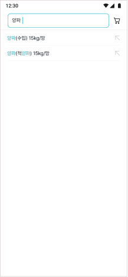
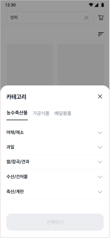
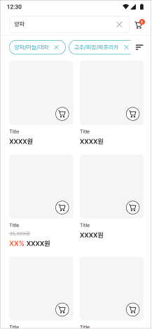
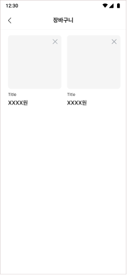

# Frontend Developer 채용 프로젝트: 상품 조회 및 장바구니

## 과제

캐시노트 마켓에서 상품을 조회하고 장바구니에 상품을 담는 서비스를 만들어 주세요. API 는 제공되지 않습니다. 요구사항에 있는 화면을 참고하여, 데이터를 자유롭게 설계해주세요. 

---

## 유의사항

- 해당 프로젝트를 fork 한후 collaborator로 corn1224를 추가해주세요.
- 화려한 방법보다, 평소에 하던 가장 익숙한 방법으로 요구사항을 구현해주세요.
- React, TypeScript 외 나머지 기술 스택은 자율적으로 결정해주세요.
- 실제 프로젝트를 진행한다고 생각하고 폴더 구조, 컴포넌트 등을 설계해주세요.
- 진행 하시면서 불분명한 요구사항에 대한 질문 또는 추가로 개선할만한 아이디어 등은 슬랙 채널을 통해서 자유롭게 질문해주세요.
- 반응형으로 작업하실 필요는 없습니다. 모바일 환경에서만 잘 나오도록 신경써주세요.
- 최신 버전의 Chrome 과 Safari 만 고려해주세요.
- README.md에 구현한 프로젝트에 대한 내용을 정리해주세요.

---

## 디자인

[Figma 링크](https://www.figma.com/file/wYnbiNiCOsFKwT1xnvOYPP/%EB%A7%88%EC%BC%93%ED%8C%80-Frontend-Developer-%EC%B1%84%EC%9A%A9-%ED%94%84%EB%A1%9C%EC%A0%9D%ED%8A%B8%3A-%EC%83%81%ED%92%88-%EC%A1%B0%ED%9A%8C-%EB%B0%8F-%EC%9E%A5%EB%B0%94%EA%B5%AC%EB%8B%88?node-id=0%3A1&t=DzgiPpBWVy6dUHon-1)

---

## 요구사항

### 1. 검색어 입력 전

**[그림 1]** 처럼 검색어를 입력하지 않았을 때 빈 화면을 보여주세요.

[그림 1]

### 2. 검색어 입력 시 검색어 자동 필터 및 하이라이팅

**[그림 2]** 처럼 검색어를 입력하면 검색어에 해당하는 상품명을 보여주세요.

1. 검색어를 입력할 때마다 검색어에 해당하는 상품명을 보여 주세요.
2. 검색어와 일치하는 부분을 하이라이팅 처 해주세요.
3. 검색 결과를 선택하거나, 엔터를 입력했을 때 **[그림 3]** 으로 이동해주세요.

[그림 2]

### 3. 검색 결과

**[그림 3]** 처럼 검색 결과를 보여주세요.

1. 검색 결과를 입력했을 때 입력창에 [X] 버튼을 보여주세요. 
2. 검색 창의 [X] 버튼을 클릭 했을 때 검색어 및 검색 결과를 초기화 시켜 **[그림 1]** 처럼 보여주세요.
3. 검색 결과를 화면에 보여주세요.
    1. 검색 결과는 상품명과 매칭되는 데이터만 보여주시면 됩니다.
4. 우측 상단에 있는 [필터] 버튼을 클릭하면 **[그림 4]** 와 같이 바텀시트를 보여주세요.
5. 상품에 있는 [장바구니] 버튼을 클릭 시, 우측 상단에 있는 장바구니 아이콘에 숫자가 증가 시켜 주세요.
    1. 이미 담겨 있는 상품을 장바구니에 추가하는 경우 “이미 장바구니에 담겨있습니다” 를 window alert 로 보여주세요.
6. 우측 상단에 있는 장바구니 아이콘을 클릭하면 **[그림 7]** 처럼 장바구니 페이지로 이동합니다.

[그림 3]

### 4. 카테고리 바텀시트

**[그림 4]** **[그림 5]** 처럼 바텀시트를 화면에 보여줍니다.

1. 총 3 depth 의 카테고리 목록을 바텀시트에 보여주세요.
    1. 1 depth 는 탭으로 표현해주세요.
    2. 2 depth 는 아코디언으로 표현해주세요.
    3. 아코디언을 선택했을 때 3depth 를 보여주세요.
2. 선택한 카테고리가 없다면 비활성화 상태인 [선택하기] 버튼을 보여주세요.
3. 카테고리를 선택하면 [선택 완료] 버튼이 활성화 되며, 버튼을 클릭 시 바텀시트가 닫히고 **[그림 6]** 처럼 필터링된 화면을 보여주세요.

[그림 4]

[그림 5]

### 5. 카테고리 필터링 결과

**[그림 6]** 처럼 선택한 카테고리에 따라 필터링된 검색 결과를 보여주세요.

1. **[그림 5]** 에서 선택한 카테고리를 검색 결과 상단에 보여주세요.
2. 선택한 카테고리가 많아 화면을 넘어갈 경우 스크롤 처리를 해주세요.
3. 카테고리의 [X] 버튼을 클릭하면, 선택된 카테고리를 지워주세요.
4. 검색 창의 [X] 버튼을 클릭하면 카테고리 및 입력된 검색어가 모두 초기화 되며 **[그림 1]** 로 이동해주세요.
5. 우측 상단의 [필터] 버튼을 클릭해서 바텀시트를 활성화 했을 때, 선택한 카테고리의 아코디언은 열려 있어야 합니다.
6. 검색&필터링 결과 페이지를 외부에 공유할 수 있도록 설계해주세요.

[그림 6]

### 6. 장바구니

홈 우측 상단에 있는 장바구니 아이콘을 클릭 시 **[그림 7]** 처럼 장바구니에 등록된 상품을 보여주세요.

1. 장바구니에 상품이 없는 경우 빈 화면을 보여주셔도 됩니다.
2. 페이지를 새로고침 하여도 장바구니 데이터는 유지됩니다.
3. 상품에 있는 [X] 버튼을 클릭하면 장바구니에서 상품이 제거 됩니다.
4. 좌측 상단의 [<] 를 클릭하면 **[그림 6]** 으로 이동하고, 이전에 검색한 데이터는 유지됩니다.

[그림 7]
